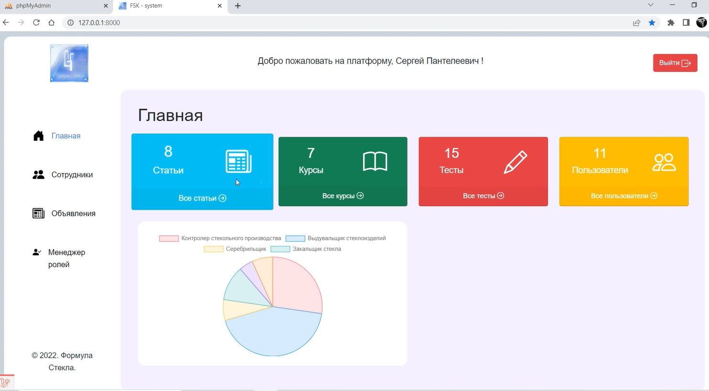
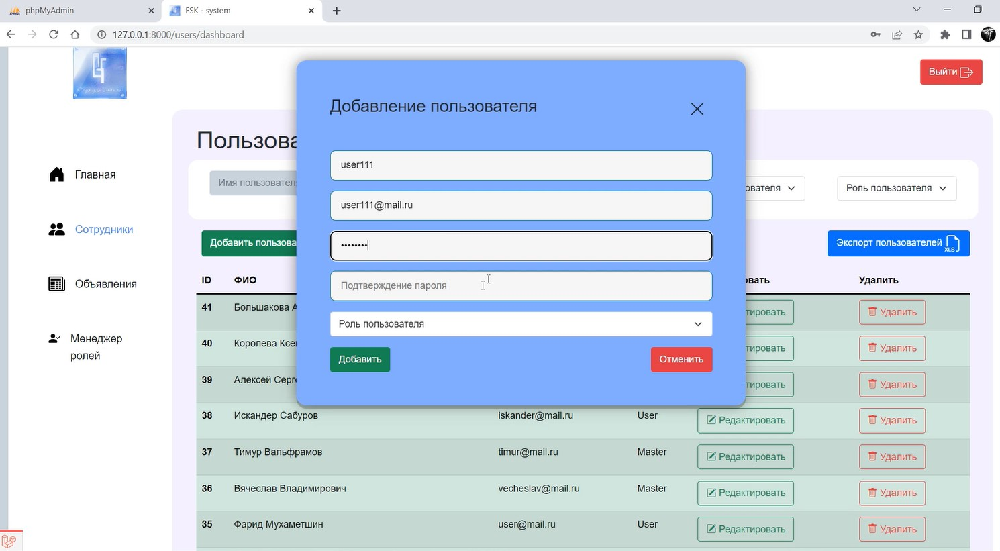
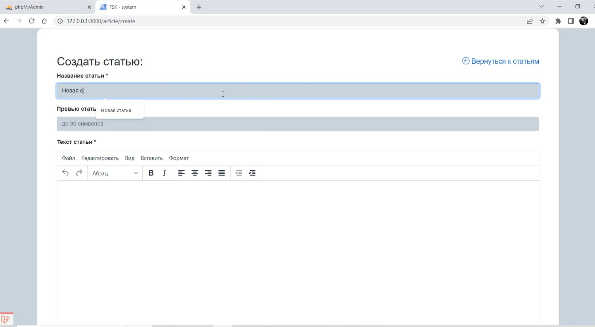
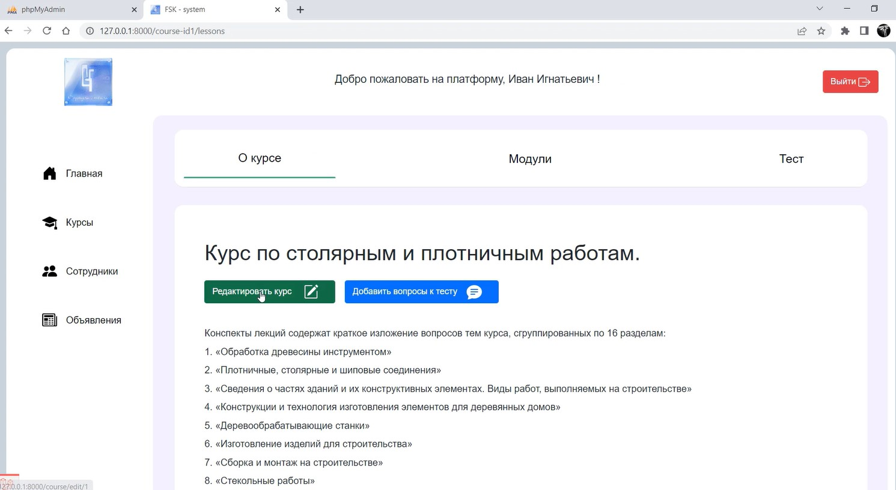
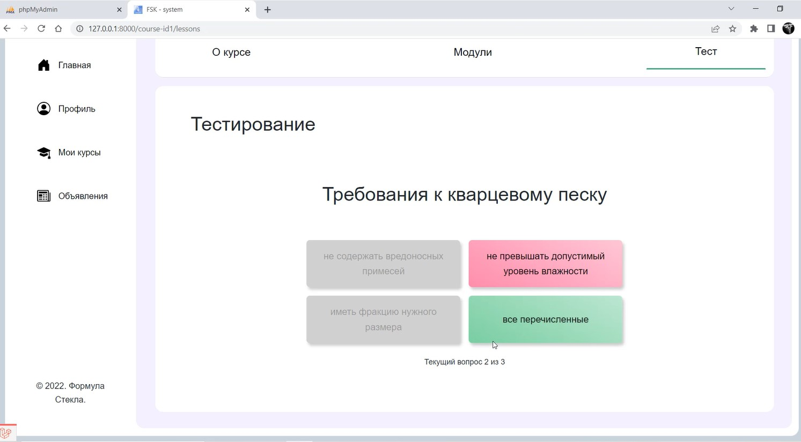

# LMS system Formula Stekla

#### The interface consists of various components.
* crud courses/lessons/tests/articles
* user management, articles management
* user roles: Admin, Teacher, Employee
* ui elements (pre-loader, likes, views)
***
### Technologies
* Laravel 8 API
* Vue3 + Vuex + VueRouter
* Axios
* Bootstrap 5
